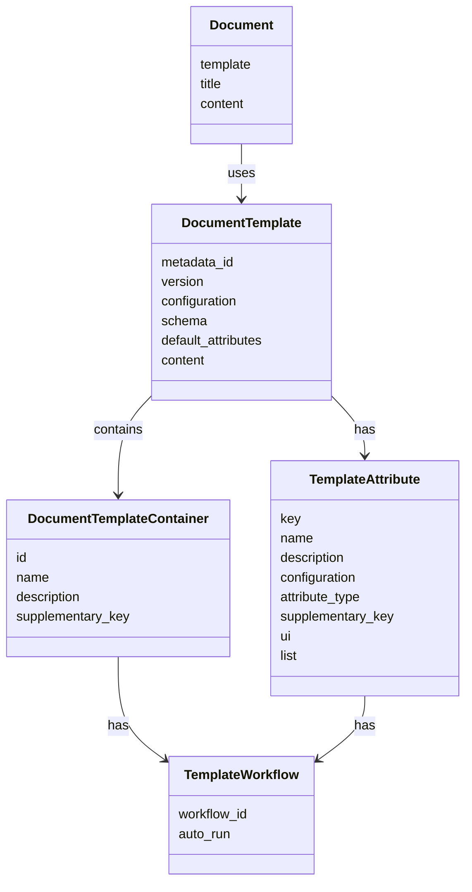

Documents extend [Metadata](/content/metadata) to allow for quickly building structured, user-facing 
content, such as
articles, videos, blog posts or other content designed for web pages or apps. Documents allow content editors to
leverage and organize content blocks to allow for flexibility in the ordering and flow of a document. Documents can be
built with a variety of content blocks such as media (video/audio), formatted text, images, simple text and more.

With the metadata model, all of the content blocks and documents can connect to repeatable workflows to allow for
customization and integration with AI/ML. In the future, this will enable Bosca to automatically generate
content to improve the productivity of content teams by accomplishing tasks such as:

- Auto-generate short descriptions of written content or video/audio media
- Create MP3s using AI voices for articles
- Generate transcriptions from video/audio media
- Create talk notes and discussion questions from a video/sermon/talk
- and More!

In addition, this data model allows for accessibility enhancements and localization.

## GraphQL Layer

In the GraphQL layer, Documents are represented by several interconnected types:

1. **Document** - The main document type that contains:
   - template (with id and version)
   - title
   - content (JSON structure containing the document's content)

2. **DocumentTemplate** - Defines the structure and behavior of documents:
   - configuration (JSON configuration for the template)
   - schema (JSON schema for validating document content)
   - content (JSON structure defining the template's content)
   - defaultAttributes (default values for attributes)
   - containers (collection of DocumentTemplateContainer objects)
   - attributes (collection of TemplateAttribute objects)

3. **DocumentTemplateContainer** - Defines containers for document content:
   - id (unique identifier)
   - name (display name)
   - description (detailed description)
   - supplementaryKey (key for supplementary content)
   - workflows (collection of TemplateWorkflow objects)

4. **TemplateAttribute** - Defines attributes for document templates:
   - key (unique identifier)
   - name (display name)
   - description (detailed description)
   - type (attribute data type)
   - supplementaryKey (key for supplementary content)
   - ui (UI component type for rendering)
   - list (boolean indicating if it's a list of values)
   - configuration (JSON configuration)
   - workflows (collection of TemplateWorkflow objects)

5. **TemplateWorkflow** - Defines workflows for templates:
   - autoRun (boolean indicating if workflow runs automatically)
   - workflow (reference to a workflow with id and name)

## Entity Relationships

The following diagram illustrates the relationships between the Document entities:



## SQL Model

The SQL model for Documents consists of several related tables:

1. **DocumentTemplate** - Stores document template data:
   - metadata_id (UUID linking to metadata)
   - version (integer version number)
   - configuration (optional JSON configuration)
   - schema (optional JSON schema)
   - default_attributes (optional JSON default values)
   - content (JSON content structure)

2. **DocumentTemplateContainer** - Stores container definitions:
   - id (string identifier)
   - name (string display name)
   - description (string detailed description)
   - supplementary_key (optional string for supplementary content)

3. **TemplateAttribute** - Stores attribute definitions:
   - key (string identifier)
   - name (string display name)
   - description (string detailed description)
   - configuration (optional JSON configuration)
   - attribute_type (enum: String, Int, Float, Date, DateTime, Profile, Metadata, Collection)
   - supplementary_key (optional string for supplementary content)
   - ui (enum: Input, Textarea, Image, Profile, Collection, Metadata, File)
   - list (boolean indicating if it's a list of values)

4. **TemplateWorkflow** - Stores workflow associations:
   - workflow_id (string identifier)
   - auto_run (boolean indicating if workflow runs automatically)

These models work together to provide a flexible and powerful system for creating, managing, and displaying structured content.

## Document Content Format

The content of a Document is structured as a tree of nodes, where each node represents a different type of content. This structure is defined by the `DocumentNode` interface in the Kotlin engine code:

```kotlin
sealed interface DocumentNode {
    val attributes: DocumentAttributes
    val content: List<DocumentNode>
    val marks: List<Mark>
}
```

Each `DocumentNode` has:
- **attributes**: Specific properties for the node type (e.g., text alignment for paragraphs, level for headings)
- **content**: Child nodes, allowing for nested content
- **marks**: Formatting marks applied to the node (e.g., bold, italic, links)

The system supports various types of nodes, including:

1. **ParagraphNode**: Represents a paragraph of text
   - Attributes: CSS classes, text alignment

2. **HeadingNode**: Represents a heading (h1, h2, etc.)
   - Attributes: CSS classes, heading level, text alignment

3. **ImageNode**: Represents an image
   - Attributes: CSS classes, alt text, source URL, title, metadata ID

4. **BulletListNode**: Represents an unordered list
   - Contains ListItemNode children

5. **OrderedListNode**: Represents an ordered list
   - Contains ListItemNode children

6. **BlockquoteNode**: Represents a blockquote
   - Contains other nodes as content

7. **ContainerNode**: A generic container for other nodes
   - Used for custom content blocks

8. **BibleNode**: Specialized node for Bible references
   - Attributes: reference, version

Formatting is applied through Mark objects, which include:
- **Bold**: Makes text bold
- **Italic**: Makes text italic
- **Link**: Creates a hyperlink with href and title
- **Hidden**: Hides content but keeps it in the document

This flexible node-based structure allows for rich, structured content that can be rendered in various ways while maintaining semantic meaning.
